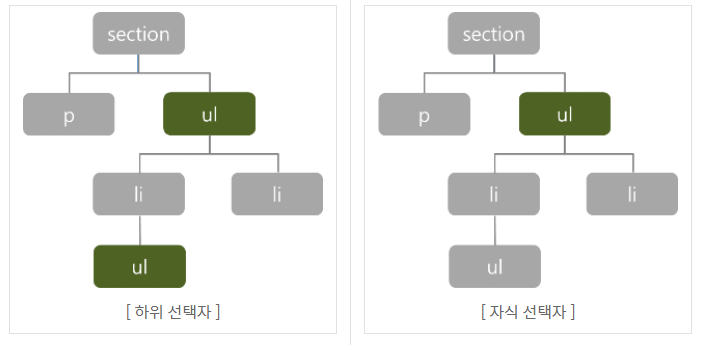

# CSS Basics

> CSS = Cascading Style Sheet
>
> 스타일, 레이아웃 등을 통해 HTML이 사용자에게 어떻게 표시 되는지를 지정하는 언어
>
> 사용자에게 문서(HTML)를 표시하는 방법을 지정하는 언어

 

## CSS 구문

- 구문은 선택자와 함께 열린다. 
- 스타일을 지정할 html 요소를 선택. 
- 다음 중괄호가 있는데 이 안에는 속성과 값 쌍 형태를 가지는 하나 또는 그 이상의 선언(declaration)이 있다. 
- 각 쌍은 우리가 선택한 요소의 속성을 지정하고 속성에 부여할 값을 지정한다.

**선언문** 

- 속성 (Property)
  - 사람이 읽을 수 있는 식별자로, 어떤 (글꼴, 너비, 배경색 등) 스타일 기능을 변경할지 나타냅니다.
- 값 (Value)
  - 각 속성에는 값을 부여한다.
  - 값은 어떻게 (글꼴을 이걸로, 배경 색을 저걸로 등)스타일 기능을 변경할 건지 나타낸다.

**CSS 정의 방법**

1. `Inline style`: 해당 태그에 직접 `style` 속성을 활용
2. 내부 참조 (`Embedding style`) : `head`안에 `<style>`에 지정
3. 외부 참조 (`Link style`): 외부 CSS 파일을 `head`안에 `<link>`를 통해 불러옴

 

## CSS Selectors

> 선택자: 어느 요소에 스타일을 적용할지 알려주는 방식

| Selector name                | What does it select                          | Example                                         |
| ---------------------------- | -------------------------------------------- | ----------------------------------------------- |
| element selector             | 해당되는 모든 HTML 요소                      | `p { }`                                         |
| ID selector                  | 해당 ID를 가진 요소                          | `#my-id { }`                                    |
| class selector               | 해당 클래스명을 가진 모든 요소               | `.my-class { }`                                 |
| attribute selector           | 특정 속성을 가진 요소                        | `img[src] { }`  => `` 중 `src`가 있는 요소 |
| pseudo-class selector        | 특정 상태에 있는 요소                        | `a:hover`                                       |
| descendant combinator (자손) | 특정 요소의 모든 해당요소 (하위의 모든 요소) | `section ul`                                    |
| child combinator (자식)      | 특정 요소의 자식 요소만 (바로 아래)          | `section > ul`                                  |

> 자손과 자식의 차이
>
> 자손은 모든 하위 요소. 자식은 바로 아래의 자식 요소
>
> 

 

## CSS 적용 우선순위

1. `!important`
   - 다른 사람들의 코드에서 발견할 때 그 의미를 알 수 있는 것은 좋음
   - 하지만 반드시 필요한 경우가 아니면 절대 사용하지 않는 것이 좋음
   - `!important` 는 cascading이 정상적으로 작동하는 방식을 변경하므로, CSS 스타일 문제를 해결하기 어려움
2. inline style
3. id 선택자
   - id는 대부분의 다른 선택자보다 우선순위가 높기 때문에 다루기가 어려워 질 수 있음
   - 대부분의 경우 id 보다는 모두  class 선택자로 작성하는 것이 좋음
   - 만약 문서 내 `링크 이동`이나 `for`를 사용하는 특별한 경우에만 아이디를 사용
4. class 선택자
5. 요소 선택자
6. 소스 순서