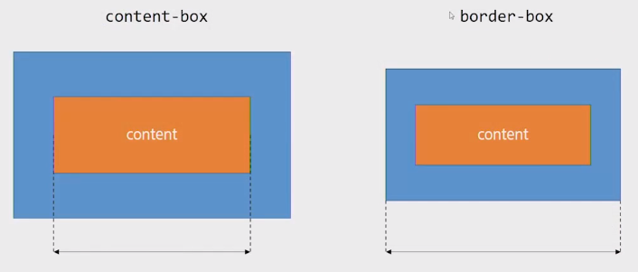

# CSS Box model

> 웹 디자인은 content를 담을 box model을 정의하고 CSS 속성을 통해 스타일(배경, 폰트와 텍스트 등)과 위치 및 정렬을 지정하는 것

- 모든 HTML 요소는 box 형태로 되어있다.
- 하나의 박스는 네 부분(영역)으로 이루어 진다.
  - content / padding / border / margin


1. Margin (바깥쪽 여백)
   - 테두리 바깥의 외부 여백
   - 배경색 지정 불가
2. Border
   - 테두리 영역
3. Padding (안쪽 여백)
   - Border(테두리) 안쪽의 내부 여백
   - 요소에 적용된 배경색, 이미지는 padding까지 적용됨
4. Content
   - 글이나 이미지, 비디오 등 요소의 실제 내용

> margin/padding 상하좌우
>
> ```css
> /* 1개: 상하좌우 모두 적용*/
> box {
>     margin: 10px;
> }
> 
> /* 2개: 상하 | 좌우 */
> box {
>     margin: 10px 20px;
> }
> 
> /* 3개: 상 | 좌우 | 하 */
> box {
>     margin: 10px 20px 30px;
> }
> 
> /* 4개: 상하좌우 */
> box {
>     margin: 10px 20px 30px 40px;
> }
> ```

<br>

## box-sizing

- 기본적으로 모든 요소의 **box-sizing**은 **content-box**

  - padding을 제외한 순수 content 영역만을 box로 지정

- 다만, 우리가 일반적으로 영역을 볼 때는 border까지의 너비를 원함

  - 그 경우 box-sizing을 **border-box**로 설정

  ```css
  .box {
      box-sizing: border-box;
  }
  ```

  



<br>

## Margin collapsing

block의 top 및 bottom margin이 때로는 (결합되는 마진 중 크기가) 가장 큰 한 마진으로 결합(combine, 상쇄(collapsed))된다.