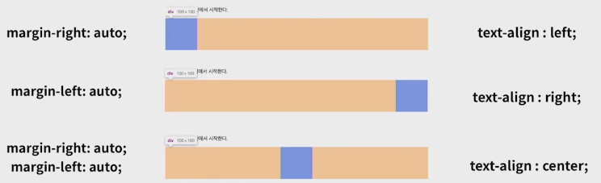

# Display

> display CSS 속성은 요소를 block과 inline 중 어느 쪽으로 처리할지와 함께 자식 요소를 배치할 때 사용할 레이아웃을 설정한다

**block**

*div, ul, ol, li, p, hr, form* 등

- 줄 바꿈이 일어나는 요소 
- 화면 크기 전체의 가로 폭을 차지
- 블록 레벨 요소안에 인라인 레벨 요소가 들어갈 수 있음
- 

**inline**

*span, a, img, input, label, b, em, i, strong* 등

- 줄바꿈이 일어나지 않는 행의 일부 요소
- content 너비만큼 가로 폭을 차지
- width, height, margin-top, margin-bottom을 지정할 수 **없음**
- 상하 여백은 line-height로 지정

> block VS inline 정렬
>
> 

**inline-block**

- block과 inline 레벨 요소의 특징을 모두 가짐
- inline처럼 한 줄에 표시 가능
- block 처럼 width, height, margin 속성 모두 지정 가능

**none**

- 해당 요소를 화면에 표시하지 않음 (공간 자체가 사라짐)
- `visibility: hidden;`은 해당 요소를 화면에서 사라지게는 하지만 공간은 사라지지 않음

