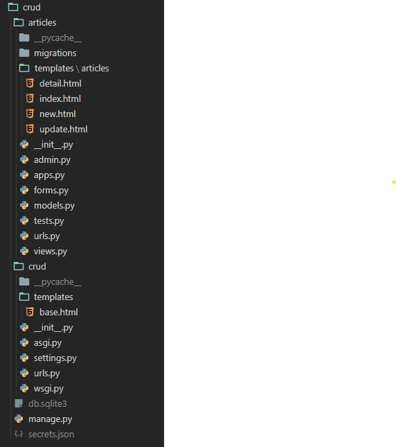

# Basic CRUD with Django

> 내가 잊지 않기 위해 적어두는 crud step-by-step

## 초기 설정

**파이썬 버전 확인**

```bash
$ python -V
```

(`V`는 대문자)

**가상환경 설정**

```bash
# venv라는 이름의 가상환경 생성
$ python -m venv venv
```

기존에 있는 가상환경 사용시 VSCode에서 `ctrl`+`shift`+`p`를 통해 **Python Interpreter**를 원하는 가상환경 속 파이썬으로 설정 후 `ctrl`+`shift`+` 으로 가상환경 활성화 

**venv에 requirements.txt 설치**

```bash
# venv 키고! 
$ pip install -r requirements.txt

# requirements.txt 만드는 법
$ pip freeze > requirements.txt
```

<br>

## 프로젝트 생성

**프로젝트 생성**

```bash
$ django-admin startproject crud
```

이후 디렉토리를 프로젝트로 설정!

**앱 생성**

```bash
$ django-admin startapp articles

# 아니면 만든 프로젝트 디렉토리 안에서 manage.py로 생성하기
$ py manage.py startapp articles
```

<br>

## 프로젝트 기본설정

> 시크릿 키 숨기는 걸 잊지 않기! 1번으로 시크릿 키부터 숨기고 세팅하기!!

### settings.py

***INSTALLED_APPS***

- 앱(지금의 경우 articles)
- `django_extensions`
- (optional) `bootstrap4`
  - must install bootstrap4 first with `pip install django-bootstrap4`

***TEMPLATES***

- `'DIRS' : [BASE_DIR/'project name'/'templates']`
  - this is where *base.html* will be located

***LANGUAGE CODE & TIME ZONE* (optional)**

- LANGUAGE_CODE = 'ko-kr'
- TIME_ZONE = 'Asia/Seoul'

<br>

### base.html

```django


<!DOCTYPE html>
<html lang="en">
<head>
  <meta charset="UTF-8">
  <meta name="viewport" content="width=device-width, initial-scale=1.0">
  <title>Document</title>
  
</head>
<body>

  <div class="container">
    
    
  </div>

  
  
</body>
</html>
```

bootrap4 library 사용을 위해 `load bootstrap4` 후 CDN 추가

<br>

## 프로젝트 url 설정

url을 통해 view에서 함수가 실행되니까 먼저 url을 설정해준다

먼저 **프로젝트(crud)**의 `urls.py`에 ***앱에 있는 url로 가라고*** 경로 설정을 해준다

```python
# crud(프로젝트) => urls.py
from django.contrib import admin
from django.urls import path, include

urlpatterns = [
    path('admin/', admin.site.urls),
    path('articles/', include('articles.urls')),	#articles 앱 추가
]
```

메인으로 **앱**에 있는 서비스들이 실행되기 때문에 **앱(aritlces)**에 url들을 모아두는 `urls.py`를 만든다

```python
# articles(앱) => urls.py
from django.urls import path
from . import views

app_name = 'articles'

urlpatterns = [
    path('', views.index, name='index')
]
```

자 이제 메인화면인 index부터 만들어보자

<br>

## 기본 페이지(index.html)

기본 화면인 index.html을 만들자

프로젝트에 여러 앱이 존재할 수 있으니 (여러 서비스) **앱 폴더 > templates > 앱 이름 폴더**를 만든다

그 안에 index.html을 만들자 (*articles > templates > articles > index.html*)

```django




<h1>index</h1>


```

### View

경로도 있고 화면단도 있으니 view를 통해 특정 url로 요청이 들어왔을 때 어떤 화면을 보여줄 건지 설정해줘야한다(Controller 역할)

우선 기본 화면인 index.html을 불러오는 함수를 만들자

```python
# views.py
def index(request):
    return render(request, 'articles/index.html')
```

이쯤 index.html이 잘 불려오는지 확인해본 후 데이터를 불러올 수 있도록 Model을 만들자

### Model

테이블이 있어야 데이터를 넣고 불러오고 할 수 있으니 먼저 테이블 생성부터하자

```python
#### models.py ####

from django.db import models

# Create your models here.
class Article(models.Model):
    
    # 제목은 길이제한이 있는 문자열
    title = models.CharField(max_length=50)

    # 내용물은 길이제한이 없는 문자열
    content = models.TextField()

    # 첫 생성되는 순간
    created_at = models.DateTimeField(auto_now_add=True)

    # 수정되는 순간
    updated_at = models.DateTimeField(auto_now=True)
```

DB schema한테 뭐 생기는지 알려주기

```bash
py manage.py makemigrations
```

이거대로 테이블 만들기

```bash
py manage.py migrate
```

### Admin 생성

DB도 만들었는데 쉽게 데이터를 넣고 수정하기 위해 관리자 계정을 만들어서 할 거다

**admin 생성**

```bash
py manage.py createsuperuser
```

사용자 이름과 비밀번호를 설정해준다. runserver해서 admin 사이트가 잘 들어가는지 확인도 해준다.

처음 admin으로 로그인하면 만들어둔 Model에는 접근이 안된다. 관리자가 Model에 접근할 수 있도록 권한을 설정해주자. 

```python
# admin.py
from django.contrib import admin
from .models import *	#import model objects from models.py

# Register imported model for admin page
admin.site.register(Article)	
```

admin 페이지에서 새로고침을 해보면 Article 객체에 접근이 가능할 것이다. 테스트 용으로 한두개만 추가해두자.

<br>

# CRUD

## READ (all articles)

이제 데이터도 있으니 불러와보자. 인덱스에서 전체 글들 보기!

#### **views.py**

- 먼저 Article 객체를 import해온다
- Article객체를 통해 저장돼있는 articles 목록을 불러온다
- context에 담아서 렌더링

```python
# views.py
from django.shortcuts import render
from .models import Article

# Create your views here.
def index(request):

    articles = Article.objects.all()

    context = {
        'articles':articles
    }

    return render(request, 'articles/index.html', context)
```

#### **index.html**

앱(articles) > templates > index.html 생성

- `` 추가해서 base.html 상속받기
- `` 안에 보여줄 화면 추가!

```django



<h1>index</h1>

<!-- articles = context에 있던 걔 맞음-->

  <h3>제목: {{article.title}}</h3>
  <p>내용: {{article.content}}</p>
  <hr>


```

<br>

## READ (detail)

이번엔 하나만 콕 찝어서 보는걸 해보자

#### urls.py

```python
path('<int:pk>/', views.detail, name='detail'),
```

- article의 pk를 기준으로 상세 내용을 불러올거다

#### views.py

```python
# request랑 pk가 같이 들어온다
def detail(request, pk):
    
    #들어온 pk를 가진 Article 객체를 디비에서 불러옴
    article = Article.objects.get(pk=pk)    
    context = {
        'article':article
    }
    return render(request, 'articles/detail.html', context)
```

#### detail.html

```django




<h1>DETAIL of pk {{article.pk}}</h1>

<p>title: {{article.title}}</p>
<p>content: {{article.content}}</p>
<p>created at: {{article.created_at}}</p>
<p>updated at: {{article.updated_at}}</p>


```

인덱스에 있는 글 목록에서 각자의 상세페이지로 넘어갈 수 있도록 링크를 달아보자

#### index.html

```django
<h1>index</h1>

<!-- articles = context에 있던 걔 맞음-->


  <!-- 쟝고식 링크 걸어주기: articles앱의 detail함수로 보낼 때 article의 pk도 같이 담아서 보내기 -->
  <a href="">
    <p>title: {{article.title}}</p>
  </a>
  <p>content: {{article.content}}</p>

  <hr>

```

<br>

## CREATE

> 글 작성에 필요한 함수 2개
>
> 1. NEW = 새 글을 작성하기 위한 페이지로 넘어가는 애
> 2. CREATE = 작성한 내용을 저장시키는 애

### NEW(=새 글 작성용 페이지로 넘어가는 애)

좽고 form을 써봅시다 (장고에서 주는 form을 안쓰고 그냥 html form을 만들어서 써도 되긴 함)

**앱**에 `forms.py`파일을 생성한다

#### forms.py

```python
# forms.py
from django import forms
from django.forms import ModelForm
from .models import *

class ArticleForm(forms.ModelForm):

    # ArticleForm에 대한 meta data
    class Meta:
        # which model do you want to create a form for?
        model = Article

        # what fields are we gonna allow?
        fields = '__all__'
```

- 좽고에서 제공하는 ModelForm은 내가 만든 모델의 field대로 알아서 form을 생성해준다~! 

#### **views.py**

열심히 만든 폼을 한번 화면에 나타내보자

```python
# 만든 form import 해오기
from .forms import ArticleForm

def new(request):
    form = ArticleForm() 	#만든 form을 가져와서 context에 던져준다
    context = {
        'form': form,

    return render(request, 'articles/new.html', context)
```

#### **urls.py**

이동하려면 링크가 있어야쥬? 

  ```python
path('new/', views.new, name='new')
  ```

#### **new.html**

보여줄 화면도 있어야쥬?

```django




<h1>NEW</h1>

<form action="" method="POST">
  
  {{form.as_p}}
  <input type="submit">

</form>


```

<br>

### CREATE(작성한 글 저장시키는 애)

이제 ArticleForm을 통해 넘어온 내용을 디비에 저장해보자

#### urls.py

```python
path('create/', views.create, name='create'),
```

#### views.py

```python
def create(request):
    # ArticleForm에 포함된 데이터를 form 변수에 담는다
    form = ArticleForm(request.POST)

    # 만약 이 form이 valid하면 디비에 저장하고 상세페이지로 넘어간다
    if form.is_valid():
        article = form.save()
        # save된 article에서 pk값을 가지고 상세페이지로 보냄
        return redirect('articles:detail', article.pk)
    
    # invalid하면 그냥 다시 form으로 가게끔하기
    return redirect('articles:new')
```

#### new.html

아까 만든 form에서 이제 submit을 눌렀을 때 해야할 action을 설정해주자

```django
<h1>NEW</h1>

<form action="" method="POST">
  
  {{form.as_p}}
  <input type="submit">

</form>
```

따란 이제 runserver해서 테스트 해보면 글 작성 후 상세페이지로 잘 넘어간 것을 확인할 수 있다

<br>

### CREATE 함수 합치기

아니 근데 잘 생각해보면 NEW랑 CREATE는 **GET**인지, **POST**인지만 다른거자나? 글 작성 함수를 하나로 합쳐보자

> GET : 데이터 불러오기만
>
> POST: 데이터 생성, 수정 가능(literally asking to post sth - like a blog post!)

#### views.py

```python
# 기존에 만들어둔 new는 주석처리했음!

def create(request):

    # POST일 때 == 글 작성한거 디비에 저장시키기!!
    if request.method == 'POST':
        # ArticleForm에 포함된 데이터를 form 변수에 담는다
        form = ArticleForm(request.POST)

        # 만약 이 form이 valid하면 디비에 저장하고 상세페이지로 넘어간다
        if form.is_valid():
            article = form.save()
            # save된 article에서 pk값을 가지고 상세페이지로 보냄
            return redirect('articles:detail', article.pk)
    
    # GET일 때 == 글 작성할 FORM 불러오기!!
    else:
        form = ArticleForm()
    
    context = {
        'form':form
    }
    return render(request, 'articles/new.html', context)
```

잊지말고 urls.py에서 **new/** url도 없애주자 

<br>

## DELETE

로직 중에서 제일 쉬운 삭제 기능을 구현해보자

#### urls.py

```python
path('<int:pk>/delete/', views.delete, name='delete'),
```

#### views.py

```python
def delete(request, pk):
    # request랑 같이 들어온 pk를 디비에서 찾아냄
    article = Article.objects.get(pk=pk)

    # 아무나 링크로 삭제 못하게 POST인지 확인먼저
    if request.method == 'POST':
        article.delete()
        return redirect('articles:index')

    # GET 요청은 그냥 삭제 안하고 다시 상세페이지로
    else:
        return redirect('aritlces:detail', article.pk)
```

#### detail.html

```django




<h1>DETAIL of pk {{article.pk}}</h1>

<p>title: {{article.title}}</p>
<p>content: {{article.content}}</p>
<p>created at: {{article.created_at}}</p>
<p>updated at: {{article.updated_at}}</p>

<!-- 삭제 -->
<form action="" method="post">

  <input type="submit" value="DELETE">
</form>


```

삭제할 수 있는 버튼/링크는 상세페이지에서 **POST**로만 가능하게끔 FORM으로 만들어준다

<br>

## UPDATE

#### urls.py

```python
path('<int:pk>/update/', views.update, name='update'),
```

#### views.py

```python
def update(request, pk):
    # 우선 바꾸고 싶은 article 객체 찾기
    article = Article.objects.get(pk=pk)

    if request.method == 'POST':
        # instance = find an existing model instance from database
        # if target instance is found from the database, save() will update that instance
        # else, save() will create a new instance of the specified model
        form = ArticleForm(request.POST, instance=article)

        if form.is_valid():
            form.save()
            return redirect('articles:detail', article.pk)

    else:
        form = ArticleForm(instance=article)
    context = {
        'form':form,
        'article':article
    }
    return render(request, 'articles/update.html', context)
```

주석에도 달았지만 장고의 `save()`는 `instance`를 수정하거나 생성할 수 있다. 그걸 이용해서 수정을 하는 것. 

#### update.html

```django




<h1>UPDATE {{article.pk}}</h1>

<form action="" method="post">

  {{form.as_p}}
  <input type="submit">

</form>


```

<br>

## 최종 폴더 구조

이걸로 장고를 이용한 기본 CRUD는 끝! 마지막으로 만들어진 폴더 구조를 살펴보자




이제 진짜 끝!