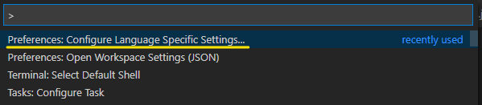
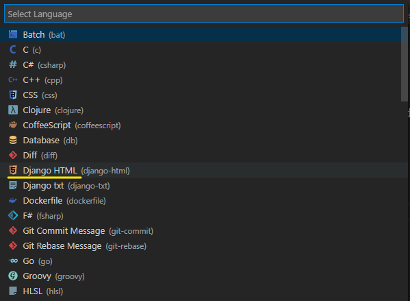
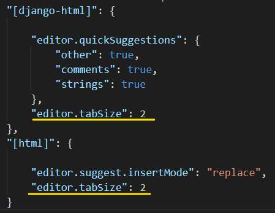

# Changing indentation for Django HTML in VSCode

>  vscode에서 html파일들의 기본 indent는 4로 설정돼있는데 그게 투머치다...2로 바꿔보자

**Windows 기준**

1. `ctrl` + `shift` + `p`

2. *Preferences: Configure language specific settings...* 

   

   

3. 원하는 언어 선택

   

   > 나는 HTML, Django HTML 모두

   

4. 열리는 settings.json 하단에 `"editor.tabSize" : 2` 추가

   

   

5. 껐다 킨다

   

6. 새로운 html 파일을 생성하면 이때부터 indent가 2로 바뀐다!