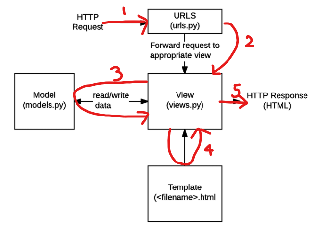

# Django: The Very Basics

### What is Django?

Django는 Python으로 만들어진 웹 프레임워크다. 

- 웹 페이지를 생성할 때 필요한 기본적인 구조 및 코드를 제공해줌으로써 개발자가 좋은 웹 서비스를 만들 수 있는 데 집중할 수 있게 해줌

 

### Why Django?

> *Django* was invented to meet fast-moving *newsroom deadlines*, while satisfying the tough requirements of experienced Web developers.

장고가 개발된 이유 자체가 *빠르게* 서비스를 만들기 위해서인 만큼 쉽고 빠르게 웹 개발이 가능하고, 제공하는 기능이 풍부하고, 사용자도 가장 많다. 

 

### How does Django work?

1. HTTP 요청이 들어옴
2. 장고의 URL mapper가 들어온 HTTP 요청을 처리할 수 있는 **View**로 매핑을 시켜줌. 이때 요청과 함께 전달된 데이터도 같이 View로 전달
3. 들어온 HTTP 요청에 대한 response를 줄 수 있는 요청 처리 함수를 찾고, **Model**을 통해서 필요한 데이터에 접근함. 
4. 요청 결과를 보여줄 수 있는 알맞는 **Template**을 가져와서 결과 데이터 html에 맞게 정리
5. 클라이언트에게 HTTP 응답 완료!