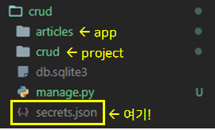

# Django Secret Key 숨기기

> settings.py 에 있는 시크릿키는 깃헙같이 오픈된 공간에는 올라가면 안됨! 몰래 내 컴에서만 보이게 숨기는 법을 알아보자


1. 프로젝트 폴더에 `secrets.json`파일 생성

```json
{
    "SECRET_KEY":"COPY AND PASTE SECRET KEY FROM settings.py"
}
```

- app 폴더가 있는 위치에서 만들면 된다! 

  


2. `settings.py`에서 SECRET_KEY 설정

```python
# settings.py

# SECRET KEY SETTINGS
import os, json	#os 및 json 읽기용 import
from django.core.exceptions import ImproperlyConfigured

# Build paths inside the project like this: BASE_DIR / 'subdir'.
BASE_DIR = Path(__file__).resolve(strict=True).parent.parent

###############################
##### SECRET KEY SETTINGS #####
###############################

#specify location of secrets.json
secret_file = os.path.join(BASE_DIR, 'secrets.json')	

#open json file as readable format in python
with open(secret_file) as f:
    secrets = json.loads(f.read())

#try-except to gain secret key from readable "secrets" file from above
def get_secret(setting, secrets=secrets):
    try:
        return secrets[setting]
    except KeyError:
        error_msg = "Set the {} environment variable".format(setting)
        
        raise ImproperlyConfigured(error_msg)

SECRET_KEY = get_secret("SECRET_KEY")
```


3. `.gitignore`에 `secrets.json` 무시하도록 추가해주기

```markdown
### Custom ###
secrets.json
```


끝! 참고로 `.gitignore`를 먼저 깃에 push하고 프로젝트를 나중에 push하는게 ignore가 제대로 반영된다