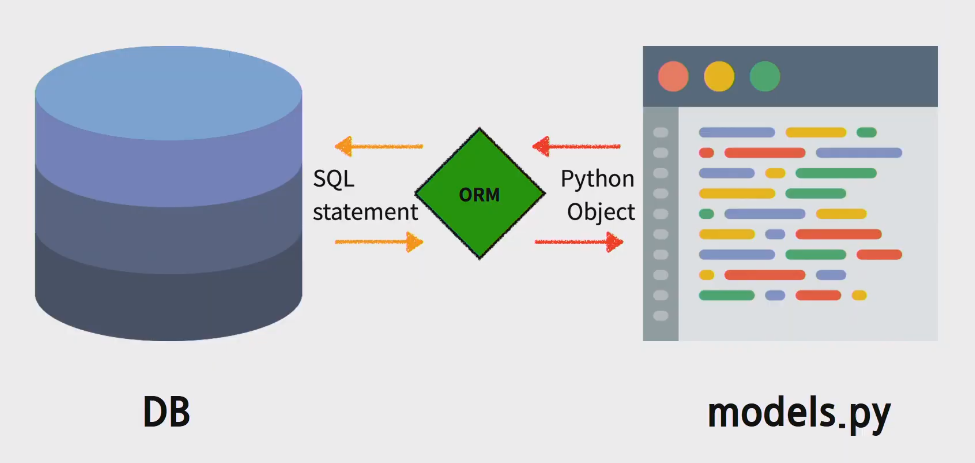
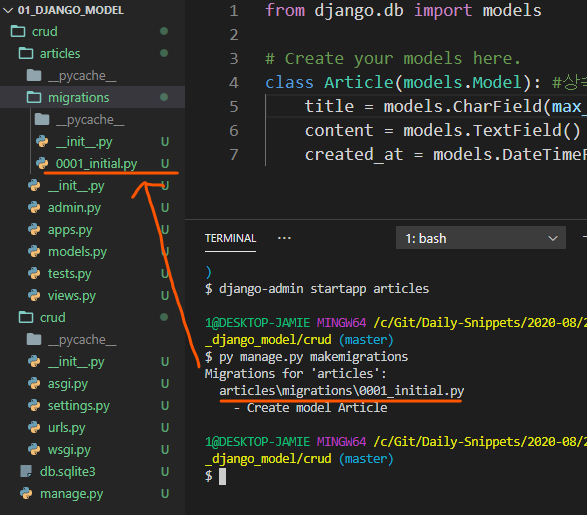
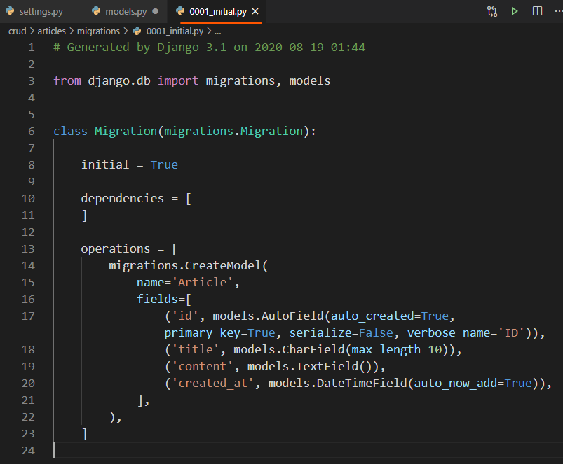
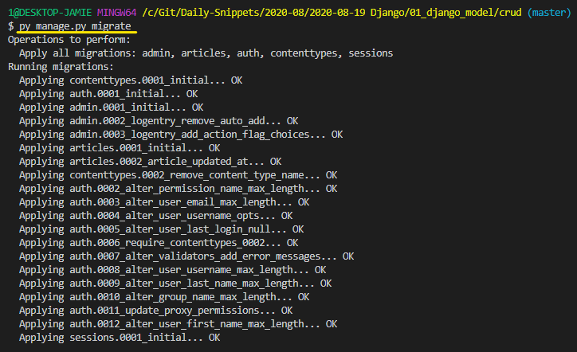
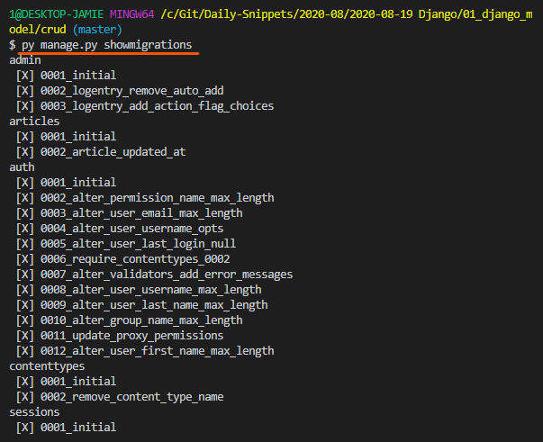

# Model

- 사용될 데이터에 대한 정의를 담고 있는 django의 클래스
- 저장된 DB의 구조를 의미
- 사용자가 저장하는 데이터들의 필수적인 필드들과 동작들을 포함
- django는 ORM 기법을 사용해 애플리케이션에서 사용할 DB를 클래스로 매핑해서 코딩
- 일반적으로 하나의 model 클래스는 하나의 table에 매핑되고, model 클래스의 속성은 table의 column에 매핑됨


<br>

### ORM(Object-Relational Mapping)



ORM은 객체 지향 프로그래밍 언어를 사용해 호환되지 않는 유형의 시스템간에(ex. Django-SQL) 데이터를 변환하는 프로그래밍 기술이다. 쉽게 말해 SQL 언어가 아닌 객체(클래스)를 사용해 DB 대신 데이터를 처리할 수 있게 해준다. 

**Django의 ORM은 파이썬으로 DB 관리를 가능하게 해준다.**

|                             장점                             |                         단점                          |
| :----------------------------------------------------------: | :---------------------------------------------------: |
|               SQL을 알지 못해도 DB 조작이 가능               | ORM만으로 완전한 서비스를 구현하기 어려운 경우가 있음 |
| SQL의 절차적 접근이 아닌 객체 지향적 접근으로 인한 높은 생산성 | - 큰 서비스의 경우 파이썬만으로 DB를 설계하기 어려움  |

<br>

# django의 custom model 정의

- project > app > models.py
- DB의 테이블 구조 및 타입을 먼저 설계한 후 모델을 정의한다
- 모델 클래스명은 **단수형**을 사용한다 (ex. Posts --> Post)

```python
from django.db import models

class Post(models.Model):
    title = models.CharField(max_length=100) 
    content = models.TextField()             
    created_at = models.DateTimeField(auto_now_add=True) 
    updated_at = models.DateTimeField(auto_now=True)
```

<br>

# Migrations

- django가 모델에 생긴 변화를 반영하는 방법

### Migration commands

- **makemigrations**: model을 변경한 것에 기반한 새로운 마이그레이션을 만들 때 사용

  - 모델을 활성화 하기 전에 DB 설계도를 작성

  - 생성된 마이그레이션 파일은 데이터베이스 스키마를 위한 버전관리 시스템이라고 생각

    ```bash
    $ py manage.py makemigrations
    Migrations for 'articles':
      articles\migrations\0001_initial.py
        - Create model Article
    ```

    

    

    >  파일을 열면 models.py에서 설계한 내용 기반으로 테이블 생성됨

    

    <br>

- **migrate**: 마이그레이션을 DB에 반영하기 위해 사용

  - db.sqlite3라는 데이터베이스 파일에 테이블을 생성
  - 모델에서의 변경 사항들과 DB의 스키마가 동기화를 이룸

  

  <br>

- **sqlmigrate**: 마이그레이션에 대한 SQL 구문을 보기위해 사용

  ```bash
  $ py manage.py sqlmigrate articles 0001
  BEGIN;
  --
  -- Create model Article
  --
  CREATE TABLE "articles_article" ("id" integer NOT NULL PRIMARY KEY AUTOINCREMENT, "title" varchar(10) NOT NULL, 
  "content" text NOT NULL, "created_at" datetime NOT NULL);
  COMMIT;
  ```

  <br>

- **showmigrations**: 프로젝트 전체의 마이그레이션과 각각의 상태를 보기 위해 사용

  

> [X]는 안됐다가 아니라 했다는 체크표시임


<br>

### Model의 중요 3단계

1. models.py: 변경사항(작성, 수정, 삭제...) 발생
2. makemigrations: 설계도 만들기
3. migrate: DB에 적용

