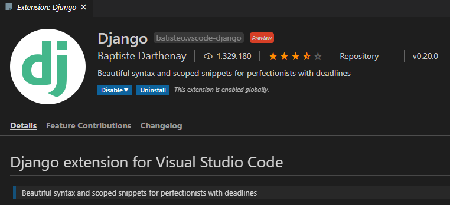
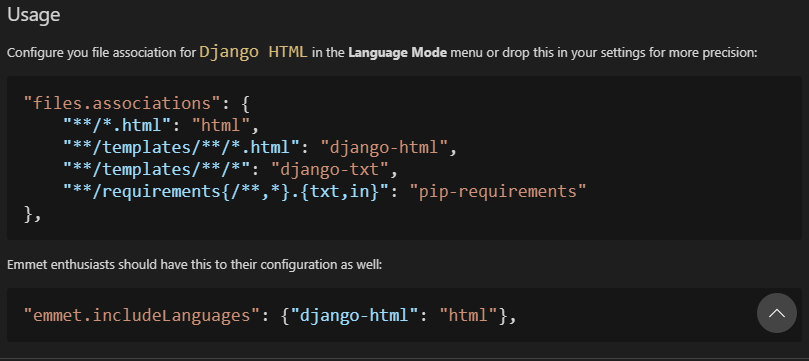
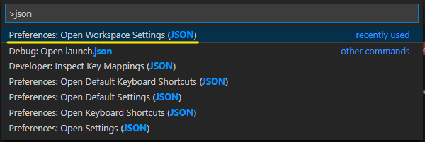
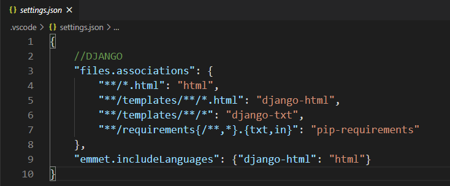

# VSCode에서 Django 사용하기

1. 장고 extension을 설치한다

   

 

2. 설치 후 extension의 **usage**란에 있는 configuration 코드를 복사한다. (Django HTML을 위한 것 같음)

   

    

3. `ctrl`+`shift`+`p`를 눌러서 `json`을 검색한 후 **Preferences: Open Workspace Settings(JSON)**을 찾아 들어간다.

   

  

4. 그러면 **settings.json**이 열린다. 여기에 아까 복사한 configuration 코드들을 붙여넣자.
   
   
   
   > 근데 나는 이상하게 AppData >>> User에 있는 settings.json이 아니라 텅 빈 settings.json이 떠서 나중에 에러가 으즈믆으 떴다. 결국 Preferences > json 검색해서 settings.json 따로 찾아감ㅠ
   
    
   
5. 끝
