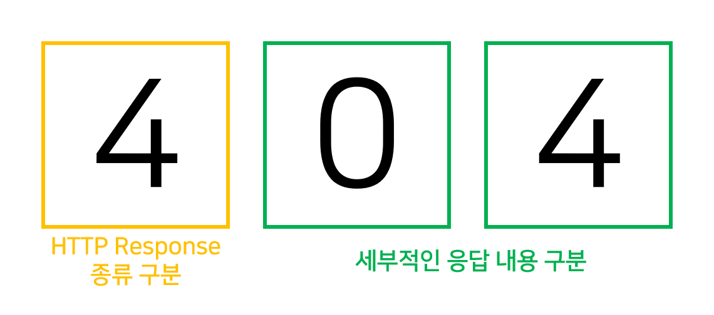

# HTTP 상태 코드

클라이언트가 보낸 request에 대한 서버에서의 처리 결과는 response의 상태 라인(status line)에 있는 상태 코드(status code)를 보고 파악할 수 있다. 

상태 코드는 100 ~ 500번대까지 있다. 

 

자주 사용되는 상태 코드

### 2## Success

- 200: [OK] 서버가 요청을 성공적으로 처리했다.
- 204: [No Content] 성공했지만 응답 본문에 데이터가 없다.
- 205: [Reset Content] 성공했지만 클라이언트의 화면을 새로 고침하도록 권고한다.
- 206: [Partial Content] 성공했지만 일부 범위의 데이터만 반환한다.

### 3## Redirection

대부분 클라이언트가 이전 주소로 데이터를 요청했기 때문에 서버에서 새로운 URL로 리다이렉트를 유도하는 경우

- 301: [Moved Permanently] 요청한 리소스가 새로운 URL에 존재한다.
- 303: [See Other] 요청한 리소스가 임시 주소에 존재한다.

### 4## Client Error

대부분 클라이언트의 코드가 잘못된 경우 (ex. 유효하지 않은 자원을 요청했거나 권한이 잘못된 경우)

- 400: [Bad Request] 요청의 구문이 잘못되었다.
- 401: [Unauthorized] 지정한 리소스에 대한 접근 권한이 없다.
- 403: [Forbidden] 지정한 리소스에 대한 접근이 금지되었다.
- 404: [Not Found] 지정한 리소스를 찾을 수 없다

> 와 드디어 404의 뜻을 알아가네

### 5## Server Error

클라이언트의 요청은 유효한데, 서버가 처리에 실패한 경우.

- 500: [Internal Server Error] 서버쪽에서 에러가 발생했다.
- 502: [Bad Gateway] 게이트웨이/프록시 역할을 하는 서버가 그 뒷단의 서버로부터 잘못된 응답을 받았다.
- 503: [Service Unavailable] 현재 서버에서 서비스를 제공할 수 없다.