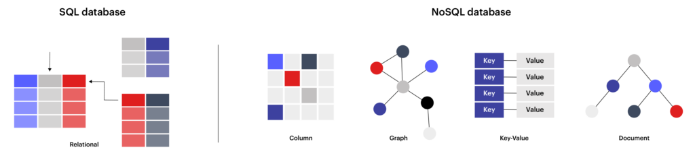

# Introduction to Redis

> a basic introduction to redis and its uses

- [What is a NoSQL database?](#what-is-a-nosql-database-)
- [Types of NoSQL databases](#types-of-nosql-databases)
  * [Key-Value](#key-value)
  * [Column](#column)
  * [Document](#document)
  * [Graph](#graph)
- [What is Redis?](#what-is-redis-)
- [Redis in the Real World](#redis-in-the-real-world)

 

## What is a NoSQL database?

- Not Only SQL
- refers to non-relational types of databases that store data differently from relational tables
- data is stored in a way that both reading and writing are fast

 

## Types of NoSQL databases

### Key-Value

- Every single item is stored as a `key-value` pair

### Column

- data is arranged by column rather than by row
- optimized for aggregate queries over large datasets much faster to process

### Document

- each key is paired with a complex data structure called a document

### Graph

- uses graph theory to store data relations in a series of vertices with edges

 

## What is Redis?

- Redis = Remote Dictionary Server
- in-memory data structure store used as a database, cache, and message broker
- it's mainly a key-value store that supports different kinds of values (a data structures server)

 

## Redis in the Real World

### Caching

- redis can be used as a means to cache data between the application and the backend data store
- it can free up the database for other operations while enabling user-friendly fast response

### Recommendations (Large Datasets)

- recommendations and customer analytics can be done in real time using redis

### Search

- RediSearch allows features such as scoring, filtering, and query expansion to work extremely fast
- automatic suggestions based on the search are also provided

### Geospatial and time-series data

- redis can be used for location-based recommendations and promotions
- great with IoT devices as sensors constantly generate data that needs to be analyzed and processed

### Messsaging/queing

- the native publish/subscribe mechanism in redis allows fast-moving data to be collected, streamed, and ingested