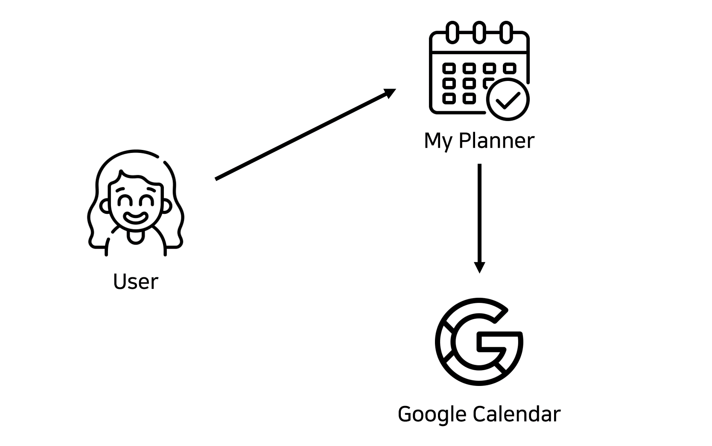
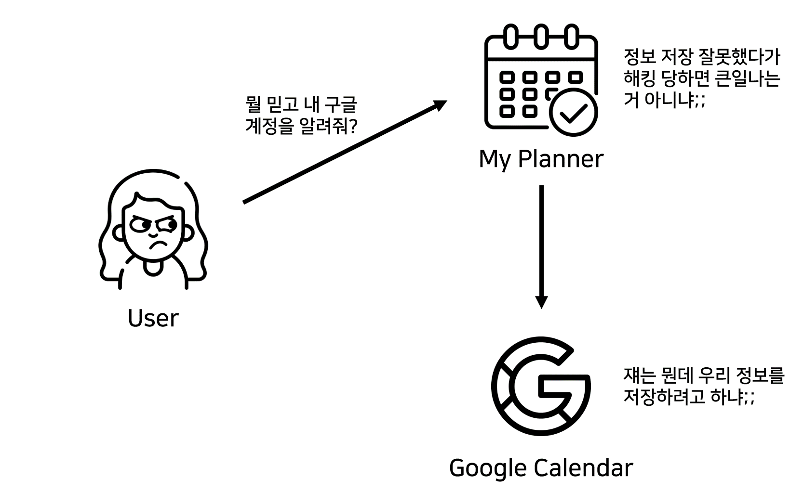
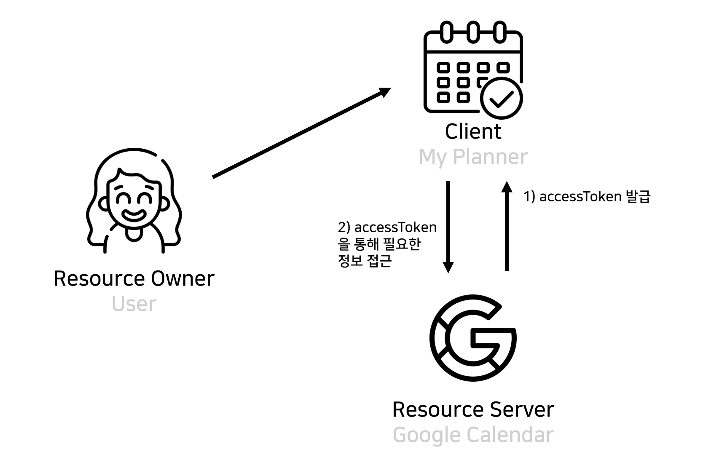
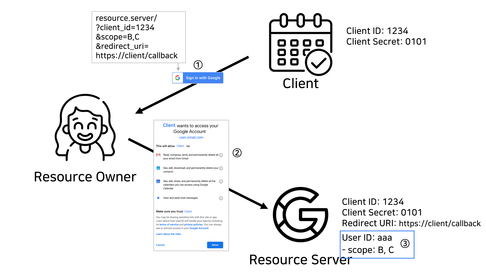

# OAuth 2.0

> 생활코딩 oAuth 2.0  수업 기반 OAuth2.0 정리

- [What is OAuth for?](#what-is-oauth-for-)
- [What is OAuth?](#what-is-oauth-)
- [OAuth Flow](#oauth-flow)
  * [Application Registration](#application-registration)
  * [Resource Owner의 승인](#resource-owner----)

# What is OAuth for?

내가 `일정관리` 서비스를 개발한다고 가정해보자. 나의 `My Planner` 서비스는 `Google Calendar`를 가져다 쓰는 서비스다. 

#### 이때, 어떻게 해야 내 서비스에서 사용자의 구글 캘린더에 접근할 수 있을까?

가장 쉬운 방법은 **내 서비스에서 사용자의 `구글ID`와 `구글 PW`를 가지고 있다가** 필요할 때 해당 아이디와 비밀번호로 구글에 로그인해서 사용자의 구글 캘린더 정보를 가져오는 것이다. 하지만 이것은 말도 안되는 일이다. 사용자가 뭘 믿고 내 서비스에 그런 중요한 걸 알려준단 말인가? 

나만 해도 큰일난다. 해킹이라도 당했다간 사용자와 구글 모두에게 소송당할 확률이 300%는 넘고, 애초에 구글 입장에서도 말도 안되는 일이기 때문에 서비스 시작 전부터 소송걸려서 망할 확률이 아주 높다. 

#### 이럴 때 필요한 게 바로 `OAuth`이다. 

# What is OAuth?

`OAuth`는 `Open Authorization`의 약자로, 다른 서비스의 회원 정보를 ID와 PW를 제공하지 않고도 주고 받을 수 있게 해주는 `authorization framework`다. OAuth를 사용하면 `accessToken`을 통해 내가 사용하고자 하는 서비스의 회원정보에 접근할 수 있게 된다. 

`OAuth`에 필요한 역할들을 다시 정리해보자.

- `Resource Owner`: 정보의 주인, 즉 사용자다. 우리는 resource owner의 정보가 필요하다.
- `Resource Server`: 정보를 가지고 있는 서비스의 서버다. 정보를 가진 `resource server`와 사용자의 정보 요청에 대한 권한을 제공하는 `authorization server`로 구분되어 있다. 
- `Client`: 내 서비스는 Resource Server에 정보 사용에 대한 요청을 보내는 입장이기 때문에 `client`라고 한다. 

# OAuth Flow

OAuth를 위한 절차는 다음과 같다.

1. 애플리케이션 등록 (Client를 Resource Server에 등록하기)
2. Resource Owner의 승인
3. Resource Server의 승인
4. AccessToken 발급 및 활용

## Application Registration

Resource Server에서 OAuth를 통해 회원정보를 받으려면 먼저 Client를 Resource Server에 등록해야한다. "등록"을 해야 `accessToken`을 요청할 권한이 생기기 때문이다. Client에 대한 기본 정보와 서비스의 결과를 전달 받을 `Redirect URI`를 입력하면 `Client ID`와 `Client Secret`을 받게 된다. 

- Client ID: 공개된 string. Client에 대한 공개 ID
- Client Secret: 절대로 공개되면 안되는 정보. 이걸 통해서 서비스가 client에 대한 인증을 하게 됨
- Authorized redict URI: 말 그대로 인증받은 리다이렉트 주소. 서비스에서 주는 결과를 보낼 곳 (내 서비스가 요청에 대한 응답을 받는 곳)

## Resource Owner의 승인

Resource Server에는 A, B, C, D라는 네 가지 회원정보가 있다고 하자. Client가 B, C라는 정보만 필요하면, 그것들에 대한 요청을 보내면 된다. 따라서 사용자에게 다른 서비스에서 B와 C라는 정보에 대한 권한을 승인하는 절차가 필요하다. 

