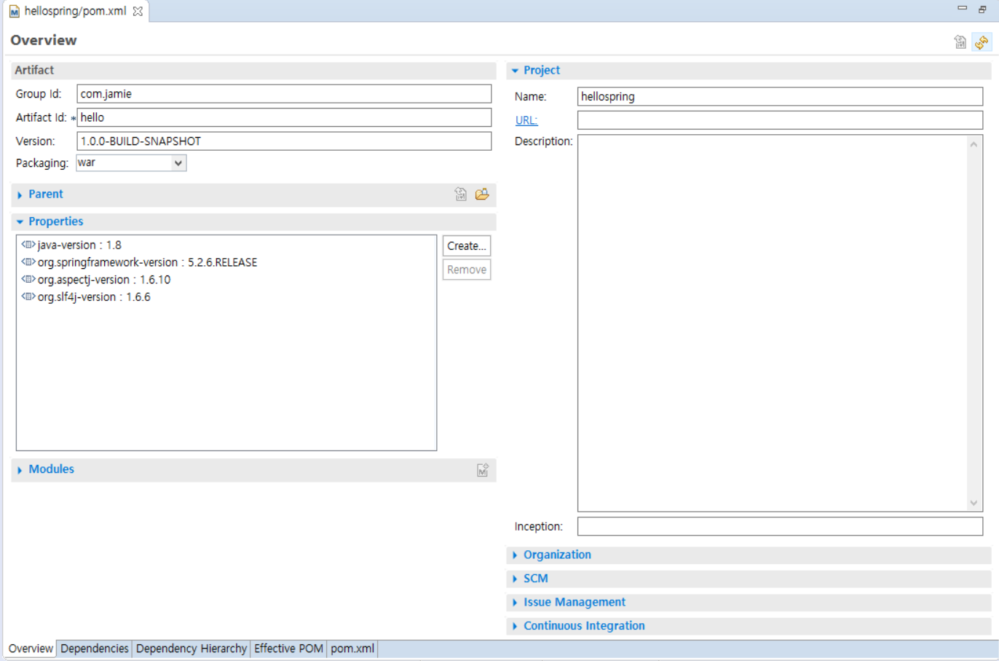
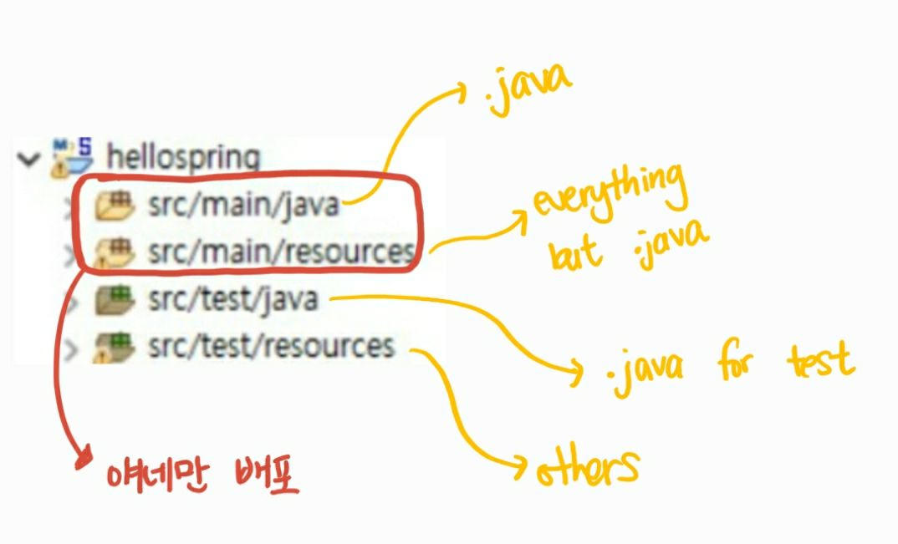

# pom.xml 이해하기

POM은 Project Object Model의 약자로, 모든 Maven 프로젝트의 핵심이라고 할 수 있다. POM은 프로젝트의 기초적인 정보부터 build에 필요한 configuration 정보들을 담고 있는 xml파일로, maven 프로젝트에서 흔히 볼 수 있는 `pom.xml`이다. 

## Overview

`pom.xml` 파일을 더블클릭하면 Overview 화면을 볼 수 있다.

- Overview 화면은 Dependency와 Plugin을 제외한 프로젝트 관련 정보를 간단하게 나타낸다.
- **Group Id :** 일종의 네임스페이스
- **Artifact Id : ** 프로젝트 이름
- **Packaging : ** 프로젝트 타입 (자바 웹 프로젝트일 때는 war, 일반 자바 프로젝트일 때는 jar)

## pom.xml 구조

- 프로젝트 기본 정보 : overview에서 확인 가능한 내용

- repositories : 원격의 메이븐 중앙 저장소에서 필요한 dependency를 받아옴

  - 로컬 저장소: `C:\Users\사용자계정` 아래 `.m2`라는 폴더
  - 만약 로컬 저장소에 필요한 dependency가 없다면 로컬 저장소로 파일을 받아옴

- properties : pom.xml에서 중복되는 값을 변수처럼 사용할 때 유용함 

  - ex: pom.xml 안의 모든 스프링 버전을 바꾸고 싶을 때, properties안의 스프링 버전을 바꾸면 나머지도 자동으로 바뀌게 됨

- dependencies : `<dependencies>` 안에 각 dependency 정의

- build : 

  - 현재 프로젝트의 디렉토리 구조를 정의함

  - 메이븐 프로젝트의 기본적인 구조:

    

  - plugins : 필요한 메이븐 플러그인 정의

## 의존성 관리

- transitive dependency: 어떤 dependency를 사용하려면 반드시 같이 추가돼야하는 dependency

- ex)

  Dependency A

   -  dependency B

  - **A is needed in order to user B**

- Maven이 생기기 전에는 그냥 리스트로 dependency를 나열했었음
  - Maven이 생긴 이후 dependency들이 관리됨
  - ex) 기존: A버전 바꾸면 일일히 찾아서 다른애들 버전 바꿔줘야함
  - ex) 메이븐: A버전 바꾸면 알아서 관련된 나머지도 바꿔줌

  